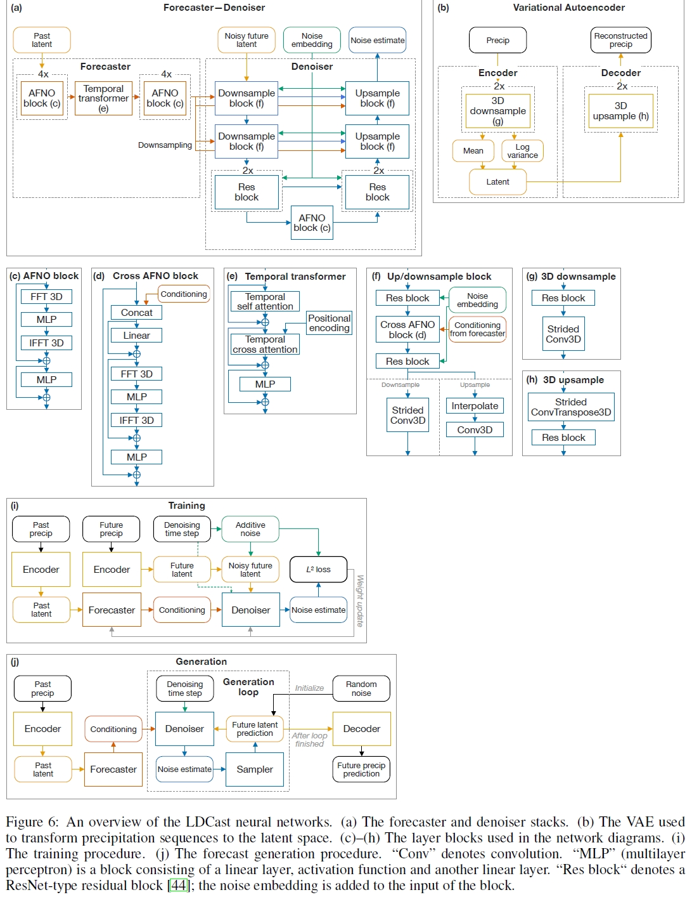

# LDCast 设计文档

> RFC 文档相关记录信息

|              |                    |
| ------------ | -----------------  |
| 提交作者      |   NKNaN            |
| 提交时间      |   2024-03-21       |
| RFC 版本号    | v1.0               |
| 依赖飞桨版本  | release 2.5.2 版本        |
| 文件名        | 20240321_ldcast.md    |

## 1. 概述

### 1.1 相关背景

[NO.38 LDCast 代码复现](https://github.com/PaddlePaddle/community/blob/master/hackathon/hackathon_6th/【Hackathon%206th】开源贡献个人挑战赛科学计算任务合集.md#no38-ldcast-代码复现)

短期降水量的预测对于基础设施管理者、处理紧急情况的公共服务以及一般公众而言是一种重要的工具。目前已有的短期降水量预测模型有：基于统计模型的 STEPS (Short-Term Ensemble Prediction System)，以及基于深度学习模型的 DGMR (Deep Generative Models of Rainfall)。其中 DGMR 是一种 conditional GAN 模型，而这意味着它的训练成本和难度比较大，还会有模型坍塌问题。本文提出使用 LDM 隐式扩散模型来预测短期降水量，因为扩散模型生成多样化样本的能力暗示了它能够应用在具有很强不确定性的预测问题中。

### 1.2 功能目标

1. 复现 LDCast 代码，实现完整的流程，包括：训练、验证、导出、推理。
2. 训练模型的 CRPS 曲线在 1km、8km、64km 三种尺度下与参考代码曲线基本一致。

### 1.3 意义

复现 LDCast 代码，能够使用 LDCast 模型进行训练、验证、导出、推理。

## 2. PaddleScience 现状

PaddleScience 套件暂无 LDCast 代码案例。

## 3. 目标调研

* 论文解决的问题：
    LDCast 模型用于预测短期降水量

* 论文提出的方法：
    LDCast 模型主要有三个组成部分：
    - Forecaster stack: 基于 AFNO (Adaptive Fourier Neural Operators)
    - Denoiser stack: latent defusion model
    - Variational autoencoder (VAE): 3D CNN、连续隐变量空间

    模型架构：
    

* 链接：
    代码：https://github.com/MeteoSwiss/ldcast
    论文：https://arxiv.org/abs/2304.12891

    需将Pytorch代码转换为Paddle，目标 CRPS 曲线：
    

## 4. 设计思路与实现方案

参考 PaddleScience 已有代码实现 LDCast
1. 数据预处理 - logarithmic transformation
2. 模型构建：
    * VAE 的 encoder decoder 与现有代码不同，需要单独实现并修改 ppsci.arch.vae 的结构
    * Latent Diffusion model 需要单独实现。（可以放在 ppsci.arch 中？）
    * Forcaster/Nowcaster 需要单独实现。
3. 转换预训练权重
4. 超参数设定
5. 生成用于 evaluation 的 CRPS 曲线

### 4.1 补充说明[可选]

无

## 5. 测试和验收的考量

复现 ldcast/scripts/metrics.py 中的 CRPS 曲线，生成论文中相应图片，检验是否一致。

## 6. 可行性分析和排期规划

- 202403：调研
- 202304：复现代码并作调整
- 202305：整理项目产出，撰写案例文档

## 7. 影响面

丰富 PaddleScience 的应用案例，在 ppsci.arch 中新增 Latent Diffusion model
